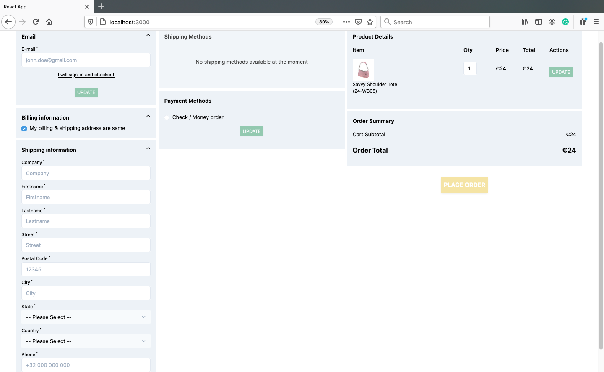
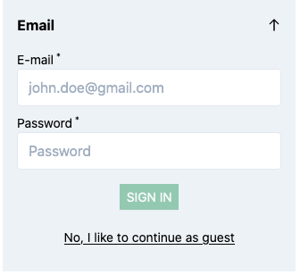
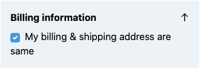
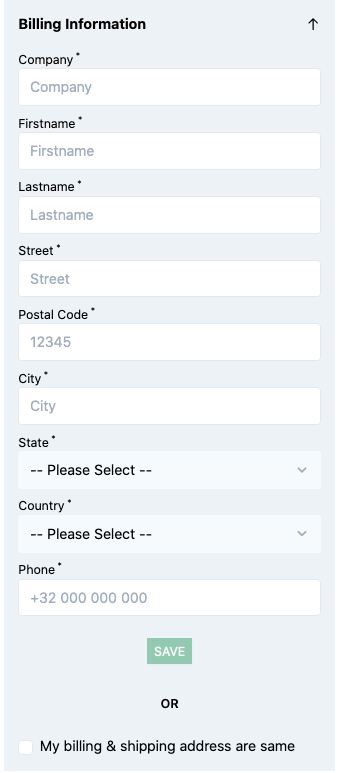
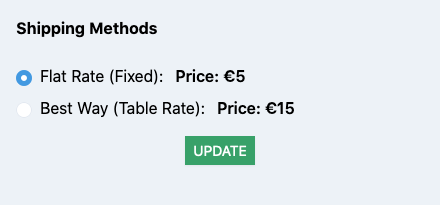
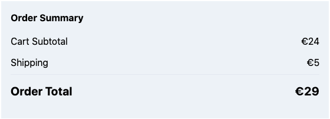

# Hyva Checkout At A Glance

Hyva checkout is essentially a one page checkout solution.  So the whole checkout looks like
below:

It contains following sections

## Email Section
Email section has mainly two purpose. It allows us to continue in a guest checkout mode or we can
continue checkout after logged-in

In the guest checkout mode, which is the default mode, there is an email address field. Upon providing
the email address and save, it will attach the email address to the cart.

In the logged-in checkout mode, the user will be provided with username and password fields. Upon submit, if the login is successful, the cart is now merged with the customer cart (if any) and then
proceed as logged-in checkout. Customer addresses will be listed out in the address sections to pick up
in this case. If the login unsuccessful, then it will be treated as guest checkout. the email address
provided will be attached to the cart and then proceed as the first case.

You can read in depth about email section in the "Checkout - Email Section" page.

## Billing Address Section
Billing address section allows to set a billing address to the cart.

By default billing address would be treated same as the shipping address.

However you can alter this by unchecking the checkbox. This will show the billing address fields and you can fill out the details there.

In the case of logged-in checkout, if the customer has billing address options, then it will be listed
out as address cards. You can pick any one of the address or create a fresh address.

You can read in depth about the billing address section in the "Checkout - Billing Address" page.

## Shipping Address Section
Shipping address section allows to set a shipping address to the cart

Shipping address section will show the shipping address fields by default. You can provide the shipping address and upon submit, it will save the shipping address and set the same shipping address as the billing address if the billing address set same as the shipping address.

In the case of logged-in checkout, if the customer has shipping address options, then it will be listed
out as address cards. You can pick any one of the address or create a fresh address.

You can read in depth about the billing address section in the "Checkout - Shipping Address" page.

## Shipping Methods Section
Based on the cart info, it will be showing the availabe shipping methods as radio option. You can pick up any of the shipping method. upon update, it will set the opted shipping method to the cart

## Payment Methods Section
Baded on the cart info, it will be showing the available payment methods as radio option. You can choose the correct option there. Upon update, it willset the opted payment method to the cart.

## Cart Items Section
Cart items section will show the product involving in the cart.

You can update the quantity of cart items from the checkout page itsef. You can also remove a cart item from the checkout page itself.

## Totals Section
Each of the above section will alter the cart data as the user fill out the form. According to the user actions, the totals would change and those changes will be shown in real time in the total section.

## Place Order
Place order button converts the cart to an order and then show the order success page.
